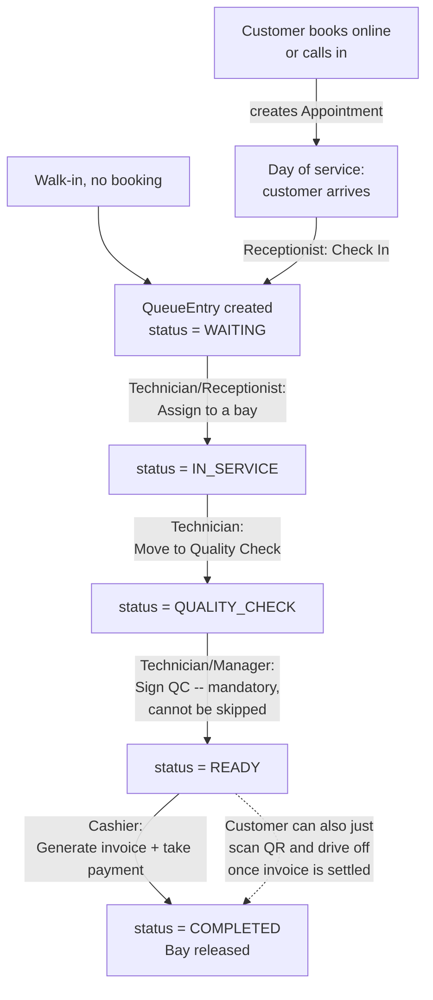

# IKINAMBA — How the system actually works

A plain-language walkthrough of the real process flow, for understanding the system —
not formatted for the thesis (see `docs/thesis/` for that). Written from the actual code,
so if something here looks wrong, the code is the source of truth, not this file.

## 1. The big picture

One vehicle's visit moves through six stages, in this order, and nothing can skip a
stage:

```
BOOKED → WAITING → IN_SERVICE → QUALITY_CHECK → READY → COMPLETED
 (optional)   (in queue)    (at a bay)    (QC sign-off)  (paid)
```

Two ways to enter the queue:
- **Online/phone booking** → shows up at the shop on the day → gets **checked in** →
  becomes a `QueueEntry`.
- **Walk-in** (no booking) → goes straight to **checked in** → becomes a `QueueEntry`.

Either way, from the moment it's a `QueueEntry`, every vehicle follows the exact same
path through the shop.

## 2. End-to-end flow



**Why QC can't be skipped:** the old paper-based process let quality checks get skipped
during busy periods. The system makes `QUALITY_CHECK → READY` a hard gate — it requires a
named technician/manager to sign off (`qcSignedById` in the database), so there's always
a person accountable for releasing a vehicle.

**Live tracking, the whole time:** every `QueueEntry` gets a random tracking token at
check-in. A customer's QR code (handed out at check-in, or emailed with the booking
confirmation) opens `/track/:token` — a page with no login that updates itself in real
time over a websocket connection whenever staff change that vehicle's status. No app to
install, no refreshing the page.

## 3. Who does what (real per-role separation)

The system used to let ADMIN/MANAGER do literally everything (a "the boss can do
anything" model). It was changed so each role only does its own job — see
`docs/thesis/01-system-overview.md` §1.4 for the formal table. In practice:

| Stage | Who does it |
|---|---|
| Book appointment | Customer (public, no login) or Receptionist (phone) |
| Check in | Receptionist |
| Assign to bay | Receptionist or Manager |
| Do the actual wash/service | Technician |
| Move to Quality Check | Technician |
| Sign off Quality Check | Technician or Manager |
| Generate invoice & take payment | Cashier |
| Refund an invoice | Manager, or Admin (oversight sign-off only) |
| Manage inventory/purchase orders | Manager |
| Approve a purchase order | Manager, or Admin (oversight sign-off only) |
| View reports / AI insights | Manager (full); Admin (read-only) |
| Manage staff accounts, audit log | Admin only |

Admin's job is **not** running the floor — it's system administration, financial-control
sign-off (refund/PO-approve), and oversight visibility into Reports/AI. That's why Admin's
home screen is the Reports page, not the live floor map.

## 4. Supporting flows (run alongside the main one)

**Notifications** — every meaningful event (booking confirmed, checked in, service
started, ready for pickup, payment received) fires an email via
`services/notifications.service.ts`, and always writes a `NotificationLog` row even if the
customer has no email on file (so nothing is silently lost). See the SMTP section below
for how these actually get delivered.

**Inventory** — low-stock items get flagged automatically; Manager creates a draft
purchase order → Admin or Manager approves it → Manager marks it received, which
restocks the inventory items in one transaction.

**AI (all of it optional — the rest of the system works with it switched off):**
- *Churn risk* and *maintenance-due* scores are computed nightly for every
  customer/vehicle by a small hand-written logistic regression model — no internet, no
  external AI service.
- *Demand forecast* (expected vehicles per day) is a simple statistical projection from
  historical visit patterns — also no AI model involved, just math.
- *Dashboard narrative* and the *chatbot* use a small local LLM (via Ollama) to turn real
  numbers into plain English, or to hold a conversation. The chatbot can now also **take
  actions** — show a live chart, check queue status, or actually book an appointment by
  conversation (asking for whatever's missing, previewing the details, then booking only
  after you confirm) — see `docs/thesis/06-ai-ml-module.md` and the chatbot's own code
  comments in `apps/server/src/ai/` for the deeper "why" behind how that's built.

## 5. Where to look in the code for each step

| Step | Backend | Frontend |
|---|---|---|
| Booking | `routes/appointments.routes.ts` | `pages/BookingPublic.tsx` |
| Check-in | `services/queue.service.ts` (`checkIn`) | `pages/Appointments.tsx` / `pages/QueueBoard.tsx` |
| Queue/bay flow | `services/queue.service.ts`, `routes/queue.routes.ts` | `pages/QueueBoard.tsx` |
| Tracking | `routes/tracking.routes.ts`, `lib/socket.ts` | `pages/TrackingPublic.tsx` |
| Billing | `services/billing.service.ts`, `routes/billing.routes.ts` | `pages/Billing.tsx`, `pages/InvoiceDetail.tsx` |
| Inventory | `routes/inventory.routes.ts` | `pages/Inventory.tsx` |
| AI scoring | `ai/scoring.ts`, `ai/forecast.ts` | `pages/AIInsights.tsx` |
| Chatbot + tools | `ai/chatbot.ts`, `ai/tools.ts` | `components/ChatWidget.tsx` |
| Roles/permissions | every `routes/*.ts` (`requireRole(...)`) | `components/Layout.tsx` (`NAV_GROUPS`), `App.tsx` |

## 6. Email delivery (SMTP)

Right now, with `SMTP_HOST` left blank in `apps/server/.env`, the system auto-creates a
disposable Ethereal test inbox on startup — emails are "sent" but only viewable via a
preview link printed in the server log, never delivered to a real inbox. To send real
emails, `SMTP_HOST`/`SMTP_PORT`/`SMTP_USER`/`SMTP_PASS` need real values — see the
conversation for the provider being set up.
