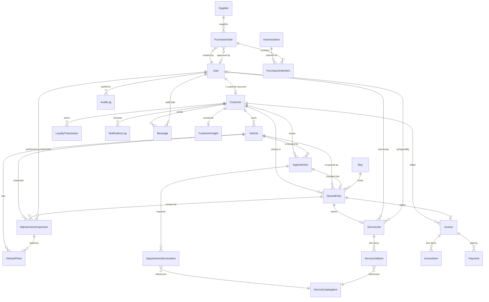

# 3. Data Dictionary & Entity Relationship Model

Source of truth: `apps/server/prisma/schema.prisma` (24 models). Database engine is
SQLite in development; SQLite has no native enum type, so enumerated fields are modeled
as validated strings — the canonical value lists live in `apps/server/src/types/enums.ts`
and are repeated as comments in the schema. This is noted here so the "Data Dictionary"
table in Chapter 3 can correctly describe the column type as `VARCHAR` / `TEXT` with a
"domain" note rather than a true SQL ENUM.

## 3.1 Entity-Relationship diagram (Mermaid — paste into a Mermaid renderer to get a figure)

## 3.2 Data dictionary (table-by-table)

### User — staff and (optionally) customer-linked login accounts
| Field | Type | Constraints | Notes |
|---|---|---|---|
| id | String (cuid) | PK | |
| email | String | unique | login identifier |
| passwordHash | String | not null | bcrypt hash, 10 rounds |
| role | String | not null | domain: ADMIN, MANAGER, CASHIER, RECEPTIONIST, TECHNICIAN, CUSTOMER |
| isActive | Boolean | default true | deactivated by ADMIN rather than deleted |
| totpSecret | String? | nullable | set once MFA enrollment begins |
| totpEnabled | Boolean | default false | gates whether login requires a TOTP code |
| customerId | String? | unique, FK → Customer | links a customer-portal login to its Customer record |
| createdAt / updatedAt | DateTime | auto | |

### Customer — a person/account that owns vehicles and is served
| Field | Type | Constraints | Notes |
|---|---|---|---|
| id | String (cuid) | PK | |
| name, phone | String | not null | |
| email, address | String? | nullable | |
| preferredContact | String | default PHONE | domain: PHONE, EMAIL, SMS |
| loyaltyTier | String | default BRONZE | domain: BRONZE, SILVER, GOLD — derived from totalSpend, see `lib/loyalty.ts` |
| loyaltyPoints | Int | default 0 | redeemable balance |
| totalSpend | Float | default 0 | lifetime spend, drives tier |
| createdAt | DateTime | auto | |

### Vehicle
| Field | Type | Constraints | Notes |
|---|---|---|---|
| id | String (cuid) | PK | |
| customerId | String | FK → Customer | |
| make, model | String | not null | |
| year | Int | not null | |
| plate | String | unique | license plate, primary lookup key for staff search |
| vin, color | String? | nullable | |
| createdAt | DateTime | auto | |

### VehiclePhoto
| Field | Type | Constraints | Notes |
|---|---|---|---|
| id | String (cuid) | PK | |
| vehicleId | String | FK → Vehicle | |
| inspectionId | String? | FK → MaintenanceInspection, nullable | photo can belong to intake or to a specific inspection |
| url | String | not null | served from `/uploads/*` |
| caption | String? | nullable | |
| type | String | not null | domain: INTAKE, DAMAGE, INSPECTION |
| takenAt | DateTime | default now | |

### ServiceCatalogItem — the price list
| Field | Type | Constraints | Notes |
|---|---|---|---|
| id | String (cuid) | PK | |
| name | String | not null | |
| category | String | not null | domain: WASH, DETAIL, MAINTENANCE, INSPECTION, ADDON |
| basePrice | Float | not null | RWF |
| durationMinutes | Int | not null | drives estimated-completion display |
| isActive | Boolean | default true | soft-disable instead of delete |

### Bay — a physical wash/service stall
| Field | Type | Constraints | Notes |
|---|---|---|---|
| id | String (cuid) | PK | |
| name | String | unique | e.g. "Bay 1" |
| status | String | default IDLE | domain: IDLE, OCCUPIED, MAINTENANCE |

### Appointment — a booked (not-yet-arrived) service slot
| Field | Type | Constraints | Notes |
|---|---|---|---|
| id | String (cuid) | PK | |
| customerId, vehicleId | String | FK | |
| scheduledAt | DateTime | not null | |
| status | String | default CONFIRMED | domain: CONFIRMED, WAITLISTED, CANCELLED, COMPLETED, NO_SHOW |
| source | String | default ONLINE | domain: ONLINE, PHONE, WALK_IN |
| notes | String? | nullable | |
| createdAt | DateTime | auto | |

### AppointmentServiceItem — join table: services requested at booking time
| Field | Type | Constraints | Notes |
|---|---|---|---|
| id | String (cuid) | PK | |
| appointmentId | String | FK → Appointment | |
| catalogItemId | String | FK → ServiceCatalogItem | |

### QueueEntry — a vehicle physically present, in the live operational queue
| Field | Type | Constraints | Notes |
|---|---|---|---|
| id | String (cuid) | PK | |
| customerId, vehicleId | String | FK | |
| appointmentId | String? | unique, FK, nullable | set only if this entry came from a check-in |
| bayId | String? | FK, nullable | set once assigned to a bay |
| status | String | default WAITING | domain: WAITING, IN_SERVICE, QUALITY_CHECK, READY, COMPLETED, CANCELLED |
| priority | Int | default 0 | loyalty tier (0/1/2) + appointment boost (+1); higher served first |
| createdVia | String | not null | domain: APPOINTMENT, WALK_IN |
| trackingToken | String | unique | random 24-hex-char token; capability for public `/track/:token` |
| checkedInAt | DateTime | default now | secondary sort key (FIFO within same priority) |
| startedAt, qcAt, completedAt | DateTime? | nullable | stage timestamps for duration analytics |

### ServiceJob — the work order opened once a QueueEntry reaches a bay
| Field | Type | Constraints | Notes |
|---|---|---|---|
| id | String (cuid) | PK | |
| queueEntryId | String | unique, FK → QueueEntry | 1:1 |
| technicianId | String? | FK → User, nullable | |
| qcSignedById | String? | FK → User, nullable | who performed the mandatory QC sign-off |
| qcSignedAt | DateTime? | nullable | |
| notes | String? | nullable | |

### ServiceJobItem — line items actually performed (may differ from what was booked)
| Field | Type | Constraints | Notes |
|---|---|---|---|
| id | String (cuid) | PK | |
| serviceJobId | String | FK → ServiceJob | |
| catalogItemId | String | FK → ServiceCatalogItem | |
| name | String | not null | **snapshot** of catalog name at job time, so price-list edits later don't rewrite history |
| price | Float | not null | snapshot of price at job time |
| qty | Int | default 1 | |

### MaintenanceInspection
| Field | Type | Constraints | Notes |
|---|---|---|---|
| id | String (cuid) | PK | |
| vehicleId | String | FK → Vehicle | |
| queueEntryId | String? | FK, nullable | links inspection to the visit it happened during, if any |
| technicianId | String | FK → User | |
| checklist | String (JSON) | not null | array of `{ item, status, notes }` |
| dtcCodes | String (JSON) | default "[]" | manually entered diagnostic trouble codes |
| mileage | Int? | nullable | |
| findings | String? | nullable | |
| nextServiceDueAt | DateTime? | nullable | |
| createdAt | DateTime | auto | |

### Invoice
| Field | Type | Constraints | Notes |
|---|---|---|---|
| id | String (cuid) | PK | |
| queueEntryId | String? | unique, FK, nullable | |
| customerId | String | FK | |
| subtotal, total | Float | not null | |
| discountAmount | Float | default 0 | |
| loyaltyPointsUsed | Int | default 0 | points redeemed against this invoice |
| loyaltyValueApplied | Float | default 0 | RWF value of redeemed points |
| tax | Float | default 0 | |
| status | String | default UNPAID | domain: UNPAID, PARTIALLY_PAID, PAID, REFUNDED |
| createdAt | DateTime | auto | |

### InvoiceItem
| Field | Type | Constraints | Notes |
|---|---|---|---|
| id | String (cuid) | PK | |
| invoiceId | String | FK → Invoice | |
| description | String | not null | |
| price | Float | not null | |
| qty | Int | default 1 | |

### Payment
| Field | Type | Constraints | Notes |
|---|---|---|---|
| id | String (cuid) | PK | |
| invoiceId | String | FK → Invoice | supports multiple rows per invoice (split payment) |
| method | String | not null | domain: CASH, MOMO, AIRTEL, CARD, LOYALTY |
| amount | Float | not null | |
| status | String | default SUCCESS | domain: PENDING, SUCCESS, FAILED, REFUNDED |
| providerRef | String? | nullable | mock-provider transaction reference |
| createdAt | DateTime | auto | |

### LoyaltyTransaction
| Field | Type | Constraints | Notes |
|---|---|---|---|
| id | String (cuid) | PK | |
| customerId | String | FK | |
| points | Int | not null | signed (+ earn, − redeem) |
| type | String | not null | domain: EARN, REDEEM, ADJUST |
| reason | String | not null | free-text audit note |
| createdAt | DateTime | auto | |

### NotificationLog
| Field | Type | Constraints | Notes |
|---|---|---|---|
| id | String (cuid) | PK | |
| customerId | String? | FK, nullable | nullable to allow non-customer-targeted broadcasts |
| channel | String | not null | domain: EMAIL, IN_APP |
| template | String | not null | e.g. APPOINTMENT_CONFIRMATION, SERVICE_READY |
| subject | String? | nullable | |
| body | String | not null | |
| status | String | default SENT | domain: SENT, FAILED, QUEUED |
| meta | String? (JSON) | nullable | |
| createdAt | DateTime | auto | |

### Message — customer ↔ staff chat
| Field | Type | Constraints | Notes |
|---|---|---|---|
| id | String (cuid) | PK | |
| customerId | String | FK | thread key |
| sender | String | not null | domain: CUSTOMER, STAFF |
| staffId | String? | FK → User, nullable | set when sender = STAFF |
| body | String | not null | |
| createdAt | DateTime | auto | |
| readAt | DateTime? | nullable | |

### InventoryItem
| Field | Type | Constraints | Notes |
|---|---|---|---|
| id | String (cuid) | PK | |
| name, unit | String | not null | |
| category | String | not null | domain: CHEMICAL, PART, CONSUMABLE |
| stockLevel | Float | not null | current quantity on hand |
| reorderThreshold | Float | not null | triggers low-stock flag when stockLevel ≤ this |
| costPerUnit | Float | not null | |
| expiryDate | DateTime? | nullable | for chemicals |
| createdAt | DateTime | auto | |

### Supplier
| Field | Type | Constraints | Notes |
|---|---|---|---|
| id | String (cuid) | PK | |
| name | String | not null | |
| email, phone | String? | nullable | |

### PurchaseOrder
| Field | Type | Constraints | Notes |
|---|---|---|---|
| id | String (cuid) | PK | |
| supplierId | String | FK | |
| status | String | default DRAFT | domain: DRAFT, SUBMITTED, APPROVED, RECEIVED, CANCELLED |
| createdById | String | FK → User | |
| approvedById | String? | FK → User, nullable | |
| createdAt | DateTime | auto | |

### PurchaseOrderItem
| Field | Type | Constraints | Notes |
|---|---|---|---|
| id | String (cuid) | PK | |
| purchaseOrderId | String | FK → PurchaseOrder | |
| inventoryItemId | String | FK → InventoryItem | |
| qty | Float | not null | |
| unitCost | Float | not null | |

### AuditLog
| Field | Type | Constraints | Notes |
|---|---|---|---|
| id | String (cuid) | PK | |
| userId | String? | FK, nullable | |
| action | String | not null | e.g. LOGIN, CREATE, PAYMENT, QC_SIGN_OFF |
| entity | String | not null | e.g. Invoice, User, QueueEntry |
| entityId | String? | nullable | |
| metadata | String? (JSON) | nullable | |
| createdAt | DateTime | auto | |

### CustomerInsight — cached AI scoring output
| Field | Type | Constraints | Notes |
|---|---|---|---|
| id | String (cuid) | PK | |
| customerId | String | unique, FK | 1:1 with Customer |
| churnRisk | Float | not null | 0..1 probability from the logistic regression model |
| churnRiskLabel | String | not null | domain: LOW (<0.33), MEDIUM (<0.66), HIGH (≥0.66) |
| maintenanceDueScore | Float | not null | 0..1, highest across the customer's vehicles |
| lastComputedAt | DateTime | default now | refreshed nightly by `jobs/cron.ts`, or on-demand |

## 3.3 Notable design decisions to call out in the write-up

- **Queue/appointment convergence:** `QueueEntry.appointmentId` is optional and unique — an
  appointment becomes exactly one queue entry when checked in, but a queue entry can also
  exist with no appointment at all (a walk-in). This single design choice is what
  resolves the AS-IS conflict between "online bookings" and "walk-ins" competing for bay
  capacity.
- **Snapshotting:** `ServiceJobItem.name/price` duplicate `ServiceCatalogItem` data on
  purpose, so historical invoices/jobs remain accurate even if the price list changes
  later — a denormalization that is intentional, not an oversight.
- **JSON-as-text columns:** `MaintenanceInspection.checklist`/`dtcCodes`,
  `NotificationLog.meta`, `AuditLog.metadata` are stored as JSON strings because SQLite has
  no native JSON column type; the application layer parses/serializes them. This is a
  reasonable trade-off to mention under "Non-Functional Requirements / Portability" — it
  would migrate to a native `jsonb` column under PostgreSQL.
