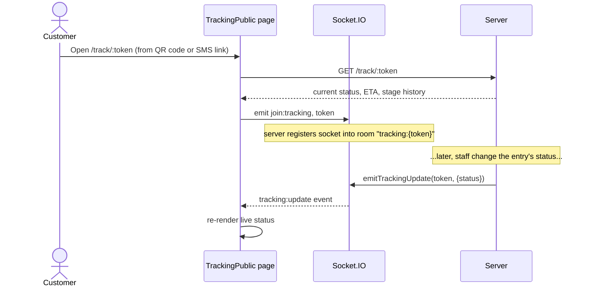
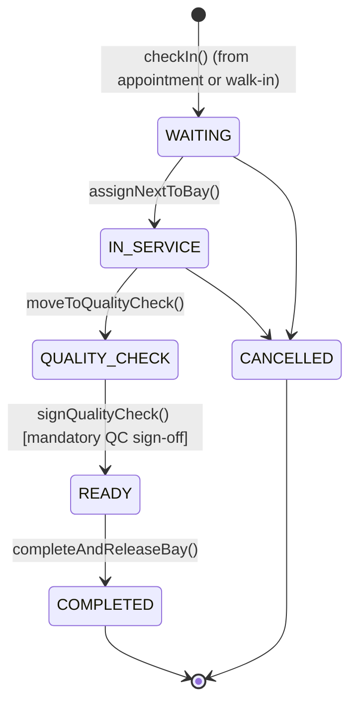

# 4. Use Cases, Sequence & Activity Diagrams

## 4.1 Actors

Same six actors as [01-system-overview.md §1.4](01-system-overview.md): ADMIN, MANAGER,
CASHIER, RECEPTIONIST, TECHNICIAN, CUSTOMER. Each has its own distinct scope rather than
a seniority hierarchy — do **not** model ADMIN/MANAGER as generalizing the other actors in
the UML diagram. The only deliberate cross-role overlaps are ADMIN's financial-control
sign-off (invoice refund, PO approval) and view-only oversight (Reports, AI insights) —
model those as ADMIN having its own use cases for exactly those actions, not as
inheritance arrows.

## 4.2 Use case inventory by module

Use this as the source list for the "Use Case Diagram of the System" figure — group nodes
by module (matches the system boundary boxes you'd draw).

| Module | Use cases | Primary actor(s) |
|---|---|---|
| Customer & Vehicle Management | Register Customer · Search Customer · View Customer Profile · Add Vehicle | CASHIER, RECEPTIONIST, TECHNICIAN, MANAGER |
| Service Booking & Appointment | Check Slot Availability · Book Appointment (online) · Reschedule Appointment · Cancel Appointment · Check In Appointment | CUSTOMER (booking only), RECEPTIONIST, MANAGER |
| Car Wash Queue & Bay Management | Add Walk-In to Queue · Assign Next Vehicle to Bay · Assign Technician · Add Service Items · Move to Quality Check · Sign Quality Check · Complete & Release Bay | RECEPTIONIST, TECHNICIAN, MANAGER |
| Vehicle Maintenance | Record Inspection · Upload Inspection/Vehicle Photos · View Service History | TECHNICIAN, MANAGER |
| Real-Time Service Tracking | Track Vehicle Status (public) · Scan QR Code | CUSTOMER |
| Payment & Billing | Generate Invoice · Record Payment (incl. split) · Redeem Loyalty Points | CASHIER, MANAGER |
| Payment & Billing (financial control) | Refund Invoice | ADMIN, MANAGER |
| Notification & Communication | Send Promotional Broadcast · Chat with Staff · View Notification Log | RECEPTIONIST, MANAGER, CUSTOMER |
| Reporting & Analytics | View Dashboard Metrics · Export Report (Excel/PDF) · Recompute AI Insights | MANAGER |
| Reporting & Analytics (oversight) | View Dashboard Metrics · View AI Insights/Churn List (read-only) | ADMIN |
| Inventory & Resource Management | Adjust Stock · Create Purchase Order · Receive Purchase Order | MANAGER |
| Inventory & Resource Management (financial control) | Approve Purchase Order | ADMIN, MANAGER |
| Security & Access Control | Login · Enroll MFA · Verify MFA · Create/Deactivate User · View Audit Log · Trigger Backup | All (Login); ADMIN (the rest) |

## 4.3 Use case descriptions (template-matching format)

Two fully worked examples in the same table format the department template uses for
"Register Use Case Description" / "Login Use Case Description" — replicate this format
for any other use case you need to formalize.

**Table: Login Use Case Description**

| Field | Description |
|---|---|
| Use Case Name | Login |
| Actors | ADMIN, MANAGER, CASHIER, RECEPTIONIST, TECHNICIAN |
| Description | A staff member authenticates with email and password (and a TOTP code if MFA is enabled) to receive a session token. |
| Pre-condition | User account exists and `isActive = true`. |
| Main flow | 1. User submits email + password to `POST /api/auth/login`. 2. System verifies the bcrypt hash. 3. If `totpEnabled`, system requires a valid 6-digit TOTP code. 4. System issues a signed JWT containing `sub`, `role`, `customerId?`. 5. Client stores the token and redirects to the dashboard. |
| Alternate flow | If `totpEnabled` and no code was supplied, the API responds `401 TOTP_REQUIRED`; the client shows a code input and resubmits. |
| Exception flow | Invalid credentials → `401 Unauthorized`; deactivated account → `403 Forbidden`. |
| Post-condition | Client holds a bearer token valid for `JWT_EXPIRES_IN` (default 8h). |

**Table: Check-In Appointment Use Case Description**

| Field | Description |
|---|---|
| Use Case Name | Check In Appointment |
| Actors | RECEPTIONIST, MANAGER, ADMIN |
| Description | Converts a confirmed appointment into a live QueueEntry the moment the customer's vehicle physically arrives. |
| Pre-condition | Appointment exists with `status = CONFIRMED`. |
| Main flow | 1. Staff opens Appointments page, finds today's appointment. 2. Staff clicks "Check In." 3. System sets `Appointment.status = COMPLETED`. 4. System creates a `QueueEntry` with `createdVia = APPOINTMENT`, a fresh `trackingToken`, and `priority` = loyalty-tier weight + 1. 5. System broadcasts `queueBoard:update` over Socket.IO. |
| Alternate flow | None — check-in is only valid from CONFIRMED. |
| Exception flow | Appointment not found → `404`; appointment not CONFIRMED (e.g. already cancelled) → `409 Conflict`. |
| Post-condition | Vehicle appears in the QueueBoard waiting list; customer can view live status at `/track/:trackingToken`. |

## 4.4 Sequence diagrams (Mermaid)

### 4.4.1 End-to-end service flow: booking → wash → payment

```mermaid
sequenceDiagram
    actor Customer
    participant Web as Booking Page
    participant API as Server (appointments.routes)
    participant DB as Database

    Customer->>Web: Select services, date, time
    Web->>API: GET /appointments/availability?date=
    API->>DB: Count CONFIRMED appts per 30-min slot
    API-->>Web: slot availability
    Customer->>Web: Submit booking form
    Web->>API: POST /appointments
    API->>DB: Create Customer/Vehicle (if new) + Appointment
    API-->>Web: booking confirmation + reference
    API->>API: notifyCustomer(APPOINTMENT_CONFIRMATION)

    Note over Customer,API: Day of service — customer arrives

    actor Receptionist
    Receptionist->>API: POST /appointments/:id/check-in
    API->>DB: Appointment.status = COMPLETED; create QueueEntry
    API-->>Receptionist: QueueEntry + trackingToken
    API->>API: emitQueueBoardUpdate()

    actor Technician
    Technician->>API: POST /queue/bays/:bayId/assign-next
    API->>DB: QueueEntry.status = IN_SERVICE; create ServiceJob
    API->>API: emitTrackingUpdate(token, IN_SERVICE)
    API->>API: notifyCustomer(SERVICE_STARTED)

    Technician->>API: PATCH /queue/:id/quality-check
    Technician->>API: PATCH /queue/:id/sign-quality-check
    API->>DB: ServiceJob.qcSignedAt set; QueueEntry.status = READY; Bay.status = IDLE
    API->>API: emitTrackingUpdate(token, READY)
    API->>API: notifyCustomer(SERVICE_READY)

    actor Cashier
    Cashier->>API: POST /billing/invoices (from queueEntryId)
    API->>DB: Create Invoice + InvoiceItems from ServiceJobItems
    Cashier->>API: POST /billing/invoices/:id/payments
    API->>API: providerFor(method).charge()
    API->>DB: Create Payment; Invoice.status = PAID; credit loyalty points
    API->>API: notifyCustomer(PAYMENT_RECEIPT)
    Cashier->>API: PATCH /queue/:id/complete
    API->>DB: QueueEntry.status = COMPLETED
```

### 4.4.2 Public tracking (no login)



## 4.5 Activity diagram (queue lifecycle) — Mermaid state form



The mandatory `QUALITY_CHECK → READY` transition (it cannot be skipped, and requires a
`qcSignedById`) is the direct system answer to the AS-IS finding that quality checks were
informally skipped during busy periods — worth a callout in Chapter 2 "Proposed
Solutions" and Chapter 4 implementation narrative.
